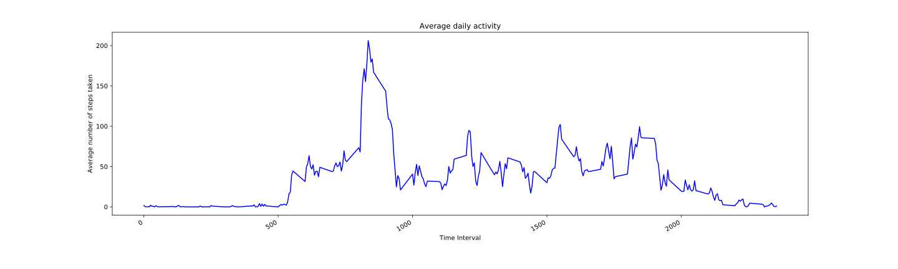

### To Do:
### Create a python script that would be able to display the information being asked for: 
### What is mean total number of steps taken per day?
For this part of the task, we ignore the missing values (NA) in the dataset.
1. Calculate the total number of steps taken per day
2. Make a histogram of the total number of steps taken each day
3. Calculate and report the mean and median of the total number of steps taken per day

### What is the average daily activity pattern?

1. Make a time series plot of the 5-minute interval (x-axis) and the average number of steps taken, averaged across all days (y-axis)

2. Which 5-minute interval, on average across all the days in the dataset, contains the maximum number of steps?
